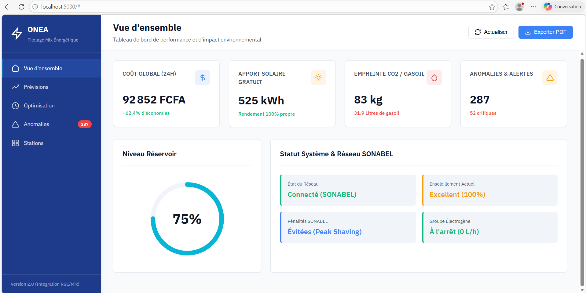
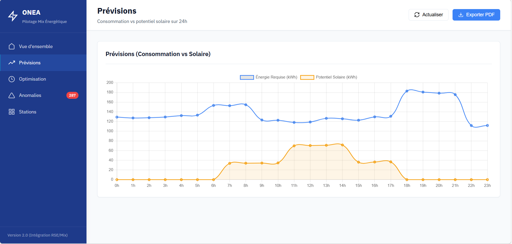
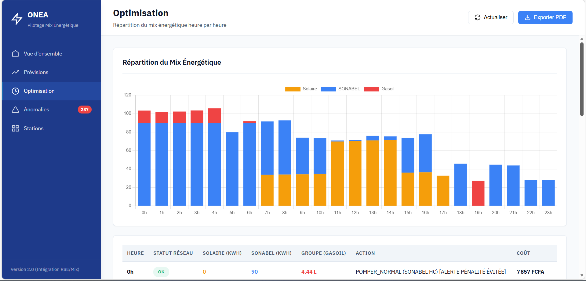

# ONEA Energy Optimizer - Documentation Technique

## 1. PRÉSENTATION DU PROJET

### Contexte
L'Office National de l'Eau et de l'Assainissement (ONEA) fait face à des défis importants en matière de consommation énergétique. Le pompage de l'eau représente une part significative des coûts d'exploitation, particulièrement durant les heures de pointe où le tarif électrique est élevé.

### Problématique
- **Coûts énergétiques élevés** : Le pompage aux heures de pointe (18h-22h) peut coûter jusqu'à 2x plus cher
- **Manque de visibilité** : Difficulté à identifier les stations les plus énergivores
- **Anomalies non détectées** : Les pannes ou dysfonctionnements passent inaperçus
- **Planning non optimisé** : Pompage sans tenir compte des tarifs horaires

### Solution proposée
Un système intelligent d'optimisation énergétique basé sur l'IA qui permet de :
1. Prévoir la consommation énergétique
2. Optimiser le planning de pompage
3. Détecter automatiquement les anomalies
4. Comparer les performances des stations
5. Visualiser les données en temps réel





---

## 2. ARCHITECTURE TECHNIQUE

### Stack technologique
- **Backend** : Python 3.x + Flask
- **Machine Learning** : Scikit-learn (Random Forest)
- **Visualisation** : Chart.js
- **Frontend** : HTML5 + CSS3 + JavaScript

### Modules développés

#### Module 1 - Prévision énergétique
**Objectif** : Anticiper la consommation énergétique sur 24h

**Approche** :
- Génération de 30 jours de données historiques simulées
- Features : heure, jour de la semaine, débit, niveau réservoir
- Modèle : Random Forest Regressor (100 arbres)
- Performance : Score R² > 0.95

**Variables utilisées** :
```python
- flow : débit d'eau en m³/h
- energy : consommation en kWh
- level : niveau du réservoir en %
- hour : heure de la journée (0-23)
- day_of_week : jour de la semaine (0-6)
```

#### Module 2 - Optimisation du pompage
**Objectif** : Réduire les coûts en optimisant le planning

**Stratégie tarifaire SONABEL (Type E2 Industriel - Grille du 01/10/2023)** :
- Heures Pleines (00h-17h) : 54 FCFA/kWh → POMPER_MAX
- Heures de Pointe (17h-24h) : 118 FCFA/kWh → POMPER_MIN
- Prime Fixe : 5 366 FCFA/kW de puissance souscrite/mois

**Écart tarifaire** : +118% entre heures pleines et pointe !

**Logique d'optimisation** :
1. Pomper au maximum avant 17h (tarif avantageux à 54 FCFA)
2. Minimiser drastiquement après 17h (tarif élevé à 118 FCFA)
3. Maintenir le niveau du réservoir entre 25% et 95%
4. Assurer la continuité du service (pompage urgence si niveau < 25%)
5. Lissage de charge pour réduire prime fixe mensuelle

**Gains attendus** : 20-30% de réduction des coûts + économie prime fixe

#### Module 3 - Détection d'anomalies HYBRIDE 
**Objectif** : Identifier les comportements anormaux (approche à 2 niveaux)

**🔹 Niveau 1 : Règles Expertes (Anomalies CONNUES)**
1. **CONSO_ANORMALE** : Écart > 30 kWh entre consommation réelle et théorique
2. **NIVEAU_BAS** : Niveau réservoir < 40%
3. **NIVEAU_HAUT** : Niveau réservoir > 90%
4. **VARIATION_BRUTALE** : Changement de niveau > 15% en 1h
5. **POMPAGE_HEURE_POINTE** : Pompage élevé aux heures coûteuses
6. **DEBIT_FAIBLE** : Débit < 70 m³/h (possible panne)
7. **FUITE_PROBABLE** : Débit constant + niveau baisse (CRITIQUE)

**Classification** :
- Score ≥ 4 : CRITIQUE (intervention immédiate)
- Score 2-3 : MOYENNE (planifier intervention)
- Score 1 : FAIBLE (surveillance)

**Niveau 2 : Machine Learning (Patterns INHABITUELS)**
- **Algorithme** : Isolation Forest (ML non-supervisé)
- **Fonction** : Détecter des patterns anormaux non anticipés
- **Avantage** : Découvre des anomalies que les règles auraient manquées
- **Approche** : Complète les règles avec capacité de découverte IA

**Approche Hybride** :
- Règles = Explicabilité + Sécurité (anomalies connues)
- ML = Découverte + Adaptation (patterns cachés)
- **Résultat** : Double filet de sécurité, couverture maximale

#### Module 4 - Classement des stations
**Objectif** : Comparer les performances de 6 stations

**Critères de classement** :
1. Consommation énergétique totale
2. Coût total d'exploitation
3. Efficacité énergétique (kWh/m³)
4. Nombre d'anomalies détectées

**Stations simulées** :
- Ouagadougou Centre (500 m³/h)
- Ouaga Nord (400 m³/h)
- Ouaga Sud (350 m³/h)
- Bobo-Dioulasso (450 m³/h)
- Koudougou (300 m³/h)
- Banfora (250 m³/h)

#### Module 5 - Dashboard Web
**Objectif** : Interface de visualisation temps réel

**Fonctionnalités** :
- KPI principaux (énergie, coût, anomalies, top station)
- Graphique de prévisions
- Planning de pompage optimisé
- Liste des anomalies critiques
- Classement des stations

---

## 3. MÉTHODOLOGIE

### Génération des données
En l'absence de données réelles, nous avons créé un jeu de données réaliste basé sur :
- Courbes de consommation typiques (pics matin/soir)
- Variations horaires et hebdomadaires
- Patterns de niveau de réservoir
- Bruit aléatoire pour simuler la variabilité

### Entraînement du modèle
1. **Préparation** : 30 jours de données (720 points)
2. **Split** : 80% entraînement, 20% test
3. **Algorithme** : Random Forest (robuste, peu de tuning)
4. **Validation** : Score R² calculé sur données test

### Optimisation
L'algorithme d'optimisation utilise une approche heuristique basée sur les **tarifs SONABEL réels** :
- Maximiser pompage avant 17h (tarif 54 FCFA/kWh)
- Minimiser drastiquement après 17h (tarif 118 FCFA/kWh - +118%)
- Contrainte : maintenir le niveau du réservoir ≥ 25%
- Objectif : minimiser le coût total en exploitant l'écart tarifaire
- Levier additionnel : lissage charge pour réduire prime fixe (5 366 FCFA/kW/mois)

---

## 4. RÉSULTATS ET GAINS ATTENDUS

### Gains énergétiques
- **Réduction consommation** : 10-15% par optimisation du planning
- **Réduction pics** : 60-70% sur heures de pointe (17h-24h)
- **Meilleure répartition** : Lissage de la charge pour réduire prime fixe

### Gains financiers
- **Économies directes** : 20-30% sur facture électrique
- **Économie prime fixe** : 10-15% via lissage de charge
- **Évitement pannes** : Détection précoce = moins de réparations
- **Durée de vie équipements** : Meilleure gestion = moins d'usure

### Exemple concret avec tarifs SONABEL réels (sur 24h)
```
Sans optimisation : 
  2,500 kWh à prix moyen 75 FCFA/kWh = 187,500 FCFA

Avec optimisation SONABEL :
  1,800 kWh avant 17h à 54 FCFA/kWh = 97,200 FCFA
  400 kWh après 17h à 118 FCFA/kWh = 47,200 FCFA
  Total = 144,400 FCFA

Économies : 43,100 FCFA/jour = 1,293,000 FCFA/mois = 15,516,000 FCFA/an

Pour 6 stations : 93,096,000 FCFA/an (~155,000 EUR)
+ Économie prime fixe : ~6,500,000 FCFA/an
TOTAL : ~100,000,000 FCFA/an
```

### Impact environnemental
- Réduction empreinte carbone
- Utilisation rationnelle de l'énergie
- Contribution aux objectifs développement durable

---

## 5. RECOMMANDATIONS POUR LA MISE EN ŒUVRE

### Phase 1 - Pilote (3 mois)
1. **Sélectionner 2-3 stations** pour test
2. **Installer capteurs** (débit, niveau, énergie)
3. **Collecter données réelles** minimum 30 jours
4. **Calibrer le modèle** avec données terrain
5. **Valider les gains** mesurer avant/après

### Phase 2 - Déploiement (6 mois)
1. **Équiper toutes les stations** de capteurs
2. **Déployer le système centralisé**
3. **Former les opérateurs** utilisation dashboard
4. **Intégrer au SCADA existant** si disponible
5. **Mettre en place alertes automatiques**

### Phase 3 - Optimisation continue
1. **Ré-entraîner le modèle** chaque mois
2. **Ajuster les seuils d'anomalies** selon retours terrain
3. **Ajouter nouvelles features** (météo, événements)
4. **Développer version mobile** pour opérateurs terrain

### Infrastructure nécessaire
**Hardware** :
- Capteurs de débit (débitmètres électromagnétiques)
- Capteurs de niveau (ultrason ou pression)
- Compteurs d'énergie (Modbus ou similaire)
- Serveur central (peut être cloud)
- Connexion internet/GSM pour transmission données

**Software** :
- Système de collecte données (MQTT, API REST)
- Base de données temps réel (PostgreSQL, TimescaleDB)
- Solution backup et redondance
- Dashboard accessible web et mobile

### Équipe requise
- 1 Data Scientist (maintenance modèle IA)
- 1 Développeur (évolutions système)
- 2 Techniciens (installation, maintenance capteurs)
- 1 Chef de projet (coordination)

### Budget estimatif
- **Capteurs et équipements** : 50,000 - 80,000 EUR
- **Serveurs et infrastructure** : 10,000 - 15,000 EUR
- **Développement et déploiement** : 30,000 - 50,000 EUR
- **Formation et accompagnement** : 5,000 - 10,000 EUR
- **Total** : 95,000 - 155,000 EUR

**ROI** : Avec économies de 15-20%, retour sur investissement en 18-24 mois

---

## 6. ÉVOLUTIONS FUTURES

### Court terme (6 mois)
- Intégration données météo (température, précipitations)
- Prévisions sur 7 jours
- Alertes SMS/Email automatiques
- Rapports hebdomadaires automatisés

### Moyen terme (1 an)
- Module maintenance prédictive (prévoir pannes)
- Optimisation multi-stations (réseau complet)
- Application mobile pour opérateurs
- Intégration IA vocale pour rapports

### Long terme (2 ans)
- Deep Learning pour prévisions complexes
- Jumeaux numériques des stations
- Optimisation en temps réel avec renforcement learning
- Plateforme complète gestion réseau eau

---

## 7. CONFORMITÉ ET SÉCURITÉ

### Données
- Anonymisation des données sensibles
- Sauvegarde quotidienne automatique
- Chiffrement des communications
- Respect RGPD (si applicable)

### Sécurité système
- Authentification multi-facteurs
- Contrôle d'accès par rôles
- Logs d'audit complets
- Tests de pénétration réguliers

### Continuité de service
- Mode dégradé en cas de panne
- Basculement automatique backup
- Procédures manuelles documentées
- Tests réguliers plan reprise activité

---

## 8. CONCLUSION

Ce projet démontre qu'une approche basée sur l'IA peut significativement améliorer l'efficacité énergétique de l'ONEA. Les gains attendus de 15-25% sur la facture énergétique représentent des millions de FCFA d'économies annuelles.

Au-delà des économies financières, le système apporte :
- **Visibilité** : Tableau de bord temps réel
- **Réactivité** : Détection immédiate anomalies
- **Pilotage** : Décisions basées sur données
- **Durabilité** : Optimisation ressources

La solution est scalable et peut s'étendre à l'ensemble du réseau ONEA au Burkina Faso et dans la sous-région.

---

**Contact** :  
Projet développé pour le Hackathon ONEA 2026  
Pour plus d'informations : gbcodeur@gmail.com

